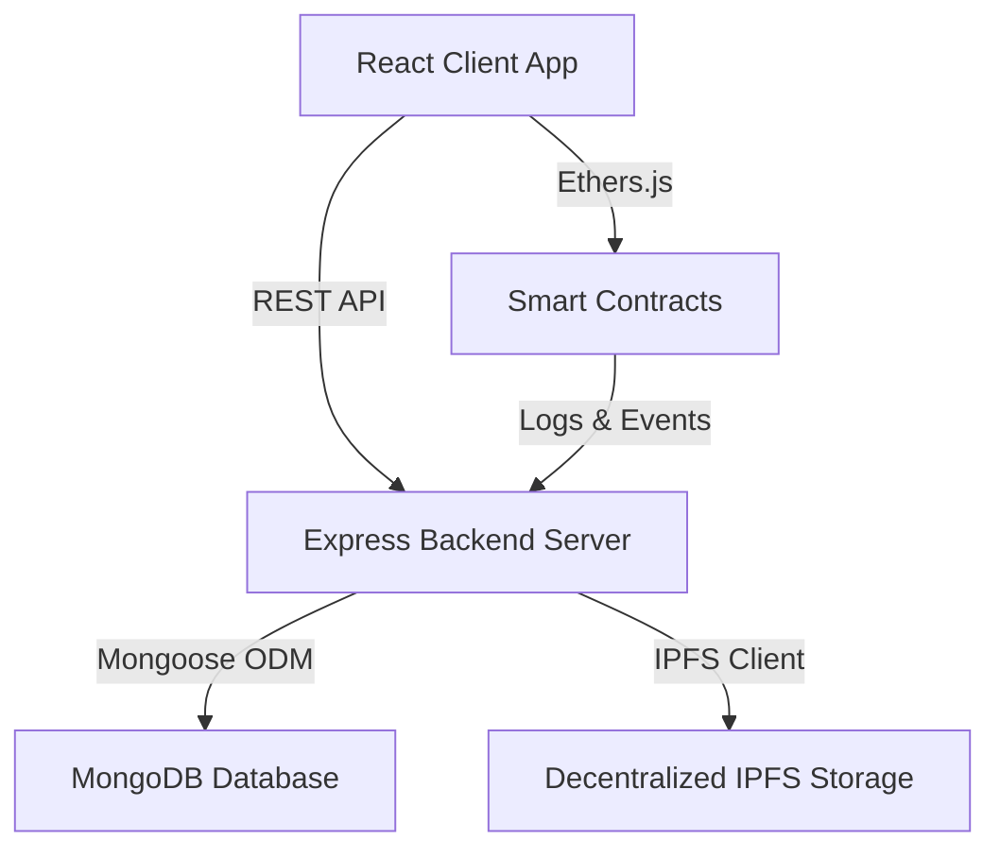

# blockchain-CleanIndia Architectural Specifications

This documentation details the structural setup of the Clean India Web3 Waste Management platform.

## System Architecture

## Protocol Smart Contracts

1. **`CleanIndiaToken (CIT)`**: Custom ERC-20 utility reward coin with capped max supply.
2. **`WasteReport`**: Coordinates report logging, geo hashing, state transitions, validation, and payout triggers.
3. **`CleanupCampaign`**: Manages campaign planning and volunteer registry metadata.
4. **`RewardDistributor`**: Formulates multi-tier reward bonuses and streak multipliers.
5. **`ImpactNFT`**: Mints ERC-721 badges for verified ecological milestones.
6. **`StakingPool`**: Locks CIT tokens to generate voting weighting for DAO proposals.
7. **`WasteClassifier`**: Feeds AI model predictions on-chain via decentralized oracles.
8. **`WasteMarketplace`**: Facilitates commercial sales of accumulated recyclables.
9. **`ZoneManager`**: Assigns municipal geographic zones to localized collector nodes.

## Backend APIs

All endpoint routing is segmented into structured handlers:
- `/api/auth`: Wallet authentication using message signature validation.
- `/api/reports`: Waste report submission, pagination, updates, and validator logs.
- `/api/campaigns`: Cleanup drives and participant rosters.
- `/api/marketplace`: Listing and bidding interface for commercial recycling batches.
- `/api/zones`: Assigning geo-boundaries and tracking collector performance metrics.
